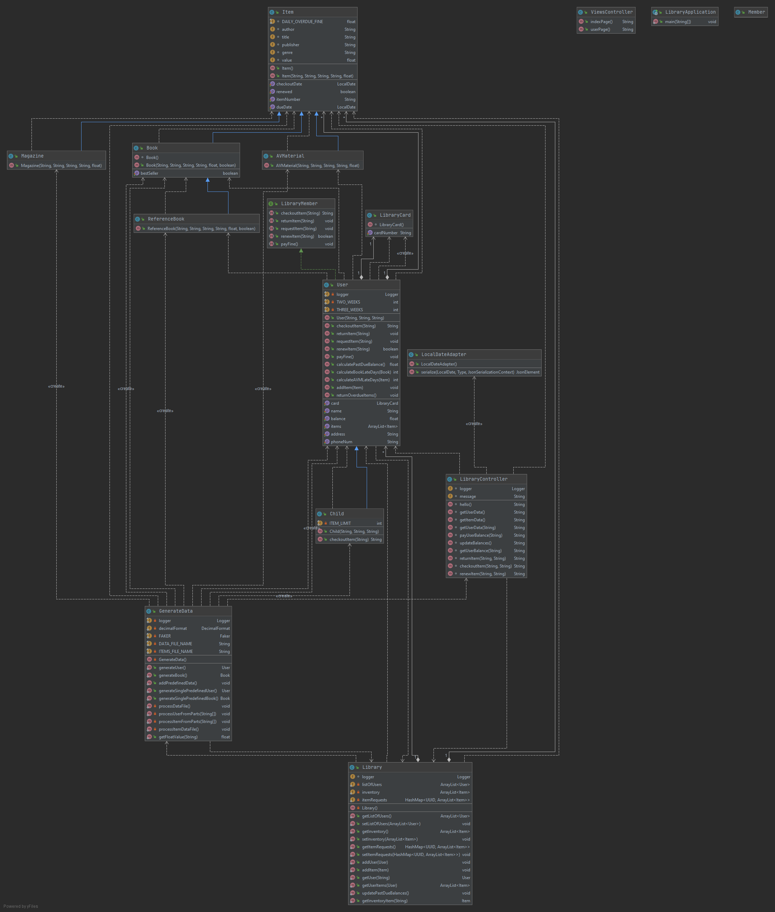

# CTL Checker Application (CS5392) 

Authors: Borislav Sabotinov, Sivaranjani Ravichandran, Sneha Sirnam, Sriram Putta

## Pre-requisites and Dependencies

Apache Maven: https://maven.apache.org/     
Node.js and NPM: https://nodejs.org/en/

## Build the app

To build the application manually: 
`mvn clean package`    

You should see "BUILD SUCCESS" on the terminal and a `target` directory should be created under root.

## Run the app

After building the app 

1. `cd target`
2. `java -jar ctl-checker-0.0.1-SNAPSHOT.jar`
   The application should start
3. Navigate to localhost:8080/hello in a browser to test. 

You should see "CS5392 CTL Checker App says hello!World!"

## Viewing the API
To view the available API endpoints and details about them:

Ensure the project is running.    
Navigate to: http://localhost:8080/swagger-ui.html

## Deploy the service to GCP
Note: cannot push image to root level. 

Build Docker image: `gcloud builds submit --tag gcr.io/ctl-checker/ctl-checker`   
- First time around, may receive prompt to enable cloudbuilds for the project
Deploy the image: `gcloud beta run deploy --image gcr.io/ctl-checker/ctl-checker`    
- First time around, may receive prompt to enable run for the project
  - Select [1] Cloud Run (fully managed) for the target platform
  - Select [22] us-central1 for the region
  - Press Enter to select the default for service name (movies)

## Class Diagram

##Guides
The following guides illustrate how to use some features concretely:

[Building a RESTful Web Service](https://spring.io/guides/gs/rest-service/)    
[Serving Web Content with Spring MVC](https://spring.io/guides/gs/serving-web-content/)    
[Building REST services with Spring](https://spring.io/guides/tutorials/bookmarks/)    

## Notes

`Unable to make private java.lang.module.Configuration() accessible: module java.base does not "opens java.lang.module" to unnamed module`
This exception occurs if you do not make the Logger object private static and final.  

##References

https://stackoverflow.com/questions/39192945/serialize-java-8-localdate-as-yyyy-mm-dd-with-gson

Some change