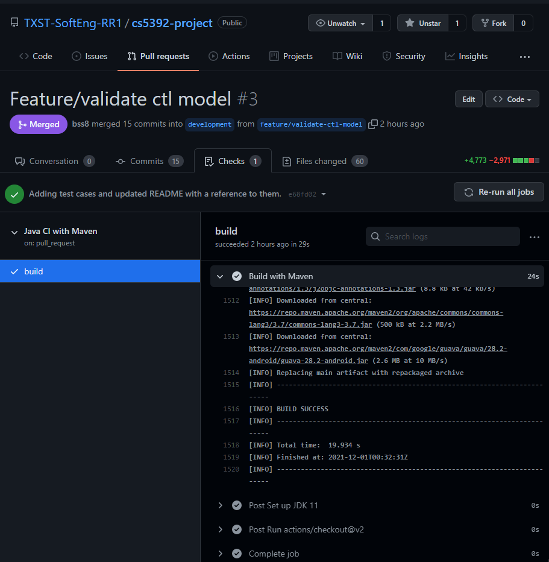
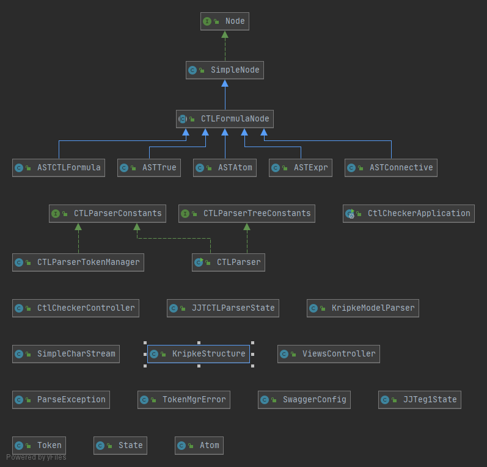
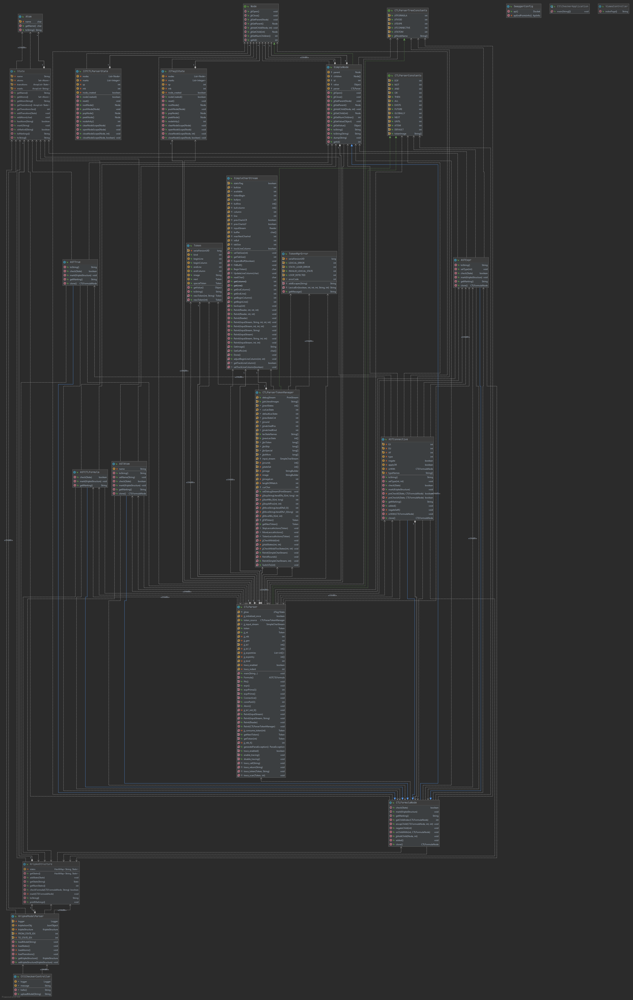

# CTL Checker Application (CS5392) 

Authors: Borislav Sabotinov, Sivaranjani Ravichandran, Sneha Sirnam, Sriram Putta    
- Source Code: https://github.com/TXST-SoftEng-RR1/cs5392-project
- Website: https://ctl.borislavsabotinov.com/   
(resolves to https://ctl-checker-pprkprkh4a-uc.a.run.app/ via port forwarding) 

## Pre-requisites and Dependencies

- Apache Maven: https://maven.apache.org/         
- JavCC: https://javacc.github.io/javacc/

Recommended:    
- Node.js and NPM: https://nodejs.org/en/

## Working with Git

1. Work off of a short-lived branch, acceptable names: 
- `feature/<name-of-feature>`
- `bugfix/<name>`
2. Pull before you push
- from your feature branch: 
`git pull origin development`
3. To check status: `git status`
4. To check branch: `git branch`

## Compile JJTree and JavaCC files for the CTL Parser

JJTree is a preprocessor included with JavaCC. 
The output of the jjt file must be ran through JavaCC to create the parser. 
JJTree constructs the parse tree from the bottom up. 
JavaCC, on the other hand, is a top-down parser. 

1. `jjtree CTLParser.jjt`
2. `javacc CTLParser.jj`

## Build the app

To view dependency tree: 
`mvn dependency:tree`

To build the application manually: 
`mvn clean package`    

You should see "BUILD SUCCESS" on the terminal and a `target` directory should be created under root.

The application may also be built via "GitHub Java Continuous Integration with Maven" 

## Run the app

After building the app 

1. `cd target`
2. `java -jar ctl-checker-0.0.1-SNAPSHOT.jar`
   The application should start
3. Navigate to localhost:8080/hello in a browser to test. 

You should see "CS5392 CTL Checker App says Hello World!"

The application may also be built and ran from inside an IDE, 
to take advantage of debugging capabilities. 

## Viewing the API documentation
To view the available API endpoints and details about them:

Ensure the project is running.    
Navigate to: http://localhost:8080/swagger-ui/index.html

## Deploy the service to GCP

The application is deployed to Google Cloud Platform and integrated with 
Google Firebase. 

Build Docker image: `gcloud builds submit --tag gcr.io/ctl-checker/ctl-checker`   
- First time around, may receive prompt to enable cloudbuilds for the project
Deploy the image: `gcloud beta run deploy --image gcr.io/ctl-checker/ctl-checker`    
- First time around, may receive prompt to enable run for the project
  - Select [1] Cloud Run (fully managed) for the target platform
  - Select [23] us-central1 for the region
  - Press Enter to select the default for service name (movies)

Note: cannot push image to root level `gcr.io/ctl-checker` directly.

## Class Diagram
Please zoom in to see details as needed. 
A clean overview of the classes with basic inheritance: 

A full class diagram: 

## Test Cases

Test cases are available under:   
 `src/main/java/resources/static/docs`

## Screenshots 

Screenshot captures of the program are available under:    
 `src/main/java/resources/static/img/screenshots`

##Guides

The following guides illustrate how to use some tools and libraries concretely:

[Building a RESTful Web Service](https://spring.io/guides/gs/rest-service/)    
[Serving Web Content with Spring MVC](https://spring.io/guides/gs/serving-web-content/)    
[Building REST services with Spring](https://spring.io/guides/tutorials/bookmarks/)    
[JJTree Reference](https://www.cs.purdue.edu/homes/hosking/javacc/doc/JJTree.html)
[JavaCC Reference](https://javacc.github.io/javacc/tutorials/examples.html#javacc-instructions)
[Spring REST Variables](https://stackoverflow.com/questions/55949044/global-variables-in-controller-class-are-overridden-with-latest-session-opened)

## Notes

`Unable to make private java.lang.module.Configuration() accessible: module java.base does not "opens java.lang.module" to unnamed module`
This exception occurs if you do not make the Logger object private static and final.  

##References
[1] https://stackoverflow.com/questions/39192945/serialize-java-8-localdate-as-yyyy-mm-dd-with-gson    
[2] Michael Huth and Mark Ryan. 2004. Logic in Computer Science: Modelling and Reasoning about Systems. 
Cambridge University Press, USA.
